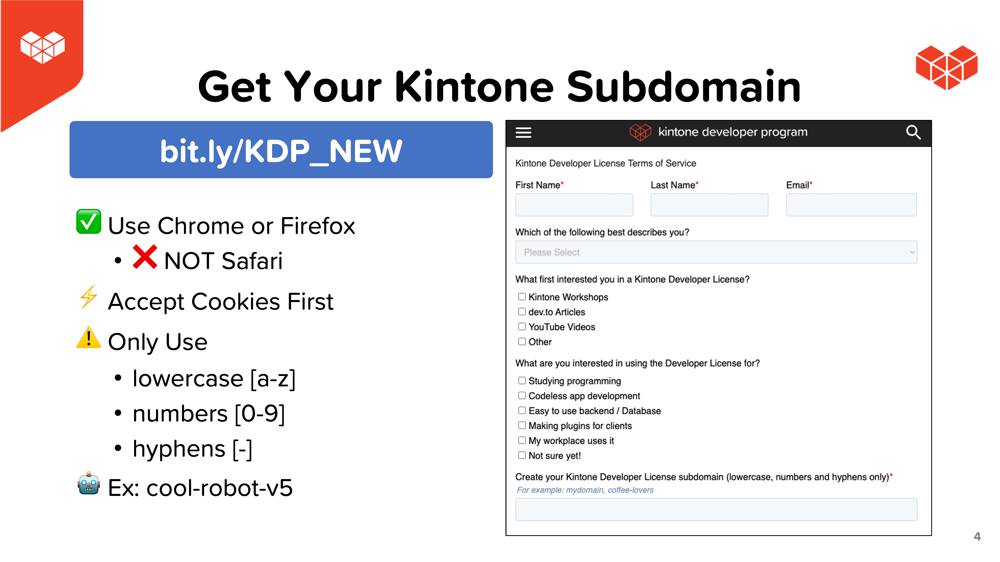
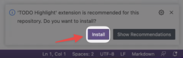

# Hosting Your React App with Web Database


# Live walk-through hosting your React App on Vercel and Netlify hosting services! Compare and contrast live!

## Outline <!-- omit in toc -->
* [Completed Project](#completed-project)
* [Get Started](#get-started)
* [Get Your Free Kintone Database](#get-your-free-kintone-database)
* [Workshop Steps](#workshop-steps)
* [Debugging](#debugging)
  * [Not seeing a highlighted `TODO:`?](#not-seeing-a-highlighted-todo)
* [Completed Code](#completed-code)
* [Overview of the Repo](#overview-of-the-repo)

## Completed Project


## Get Started
_Clone the Repo & Install Dependencies_ 💪

First, clone the [kintone-workshops/host-react-app-database](https://github.com/kintone-workshops/host-react-app-database) repo!  🚀  
Then go inside the folder & install the dependencies!

```shell
cd Downloads

git clone https://github.com/kintone-workshops/host-react-app-database

cd host-react-app-database

npm install

```

Open the `host-react-app-database` folder in [VS Code](https://code.visualstudio.com/docs/getstarted/tips-and-tricks#_command-line) as well:

```shell
code .
```

## Get Your Free Kintone Database

[kintone.dev/new/](http://kintone.dev/new/)
* ⚡ Only use lowercase, numbers, & hyphens in your subdomain
* ⚠ Do not use uppercase or special characters

|                                                                                                               |                                                                                                                                 |
| ------------------------------------------------------------------------------------------------------------- | ------------------------------------------------------------------------------------------------------------------------------- |
|          |  |
|  |                                                               |

For more information, check out the [Workshop_Steps.md > B. Get Your Free Kintone Database](./docs/Workshop_Steps.md#b-get-your-free-kintone-database) section!

---

## Workshop Steps

* [A. Get started - clone the repo \& install dependencies](./docs/Workshop_Steps.md#a-get-started---clone-the-repo--install-dependencies)
* [B. Get your free Kintone database](./docs/Workshop_Steps.md#b-get-your-free-kintone-database)
* [C. Create a `.env` file](./docs/Workshop_Steps.md#c-create-a-env-file)
* [D. Create a Kintone web database app](./docs/Workshop_Steps.md#d-create-a-kintone-web-database-app)
  * [Input Fields](./docs/Workshop_Steps.md#input-fields)
  * [Steps to create the Kintone App](./docs/Workshop_Steps.md#steps-to-create-the-kintone-app)
* [E. Generate an API token for the Kintone app](./docs/Workshop_Steps.md#e-generate-an-api-token-for-the-kintone-app)
* [F. Let's start coding!](./docs/Workshop_Steps.md#f-lets-start-coding)
  * [1. Create two new folders to work in, and copy the backend code to them](./docs/Workshop_Steps.md#1-create-two-new-folders-to-work-in-and-copy-the-backend-code-to-them)
  * [2. Create and setup config files for Netlify and Vercel](./docs/Workshop_Steps.md#2-create-and-setup-config-files-for-netlify-and-vercel)
  * [3. Time to upload our code from GitHub, and setup our deployments!](./docs/Workshop_Steps.md#3-time-to-upload-our-code-from-github-and-setup-our-deployments)

---

---

## Debugging
**Let's Fix Those Problems** 💪

Here is a rundown of common problems that may occur & their solutions!

TODO: Update the following section with relevant Debug snippets - See [Snippets_Debug.md](./Snippets_Debug.md)

### Not seeing a highlighted `TODO:`?
Click the `Install` button on the VS Code pop-up message to install [TODO Highlight extension](https://marketplace.visualstudio.com/items?itemName=wayou.vscode-todo-highlight).
* [](./docs/img/common_vscode/vscode-setting-extension-HD.png)  

---

## Completed Code
If you want the completed code for this workshop, you can find it here:  
[Solution](./docs/Solution.md)

---

## Overview of the Repo

<details>
  <summary> ↯ Overview of the Repo ↯ </summary>

| File                                                         | Purpose                                                                   | Need to Modify?        |
| ------------------------------------------------------------ | ------------------------------------------------------------------------- | ---------------------- |
| [package.json](package.json)                                 | Project's metadata & scripts for building and uploading the customization |                        |
| [.env.example](.env.example)                                 | The template for the .env file                                            |                        |
| [.env](.env)                                                 | Holds the Kintone login credential and View ID                            | Yes! - Create it       |
| [src/main.js](src/main.js)                                   | Heart of the project handling the API request body & adding a button      | Yes! Complete the code |
| [docs/Workshop_Steps.md](./docs/Workshop_Steps.md)           | Step-by-step guide that we do during the workshop                         |                        |

</details>
