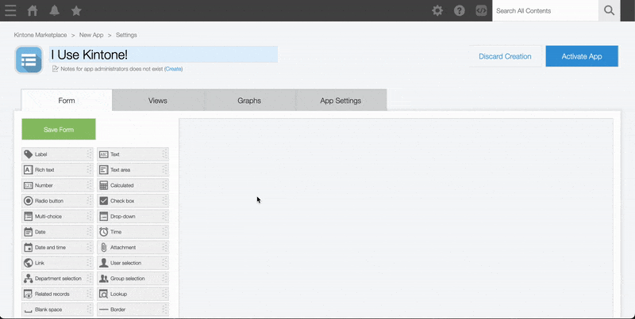
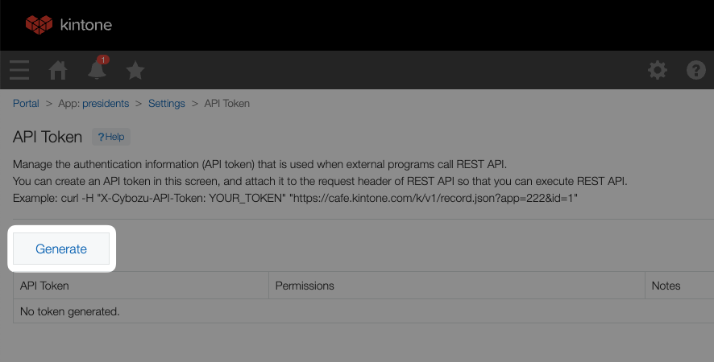
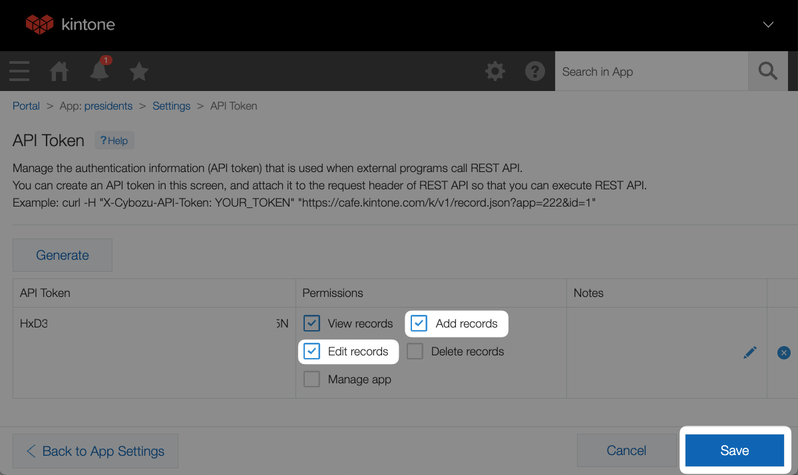

# Workshop Steps
This guide outlines all the steps required to complete the workshop.

## Outline <!-- omit in toc -->
* [A. Get started - clone the repo \& install dependencies](#a-get-started---clone-the-repo--install-dependencies)
* [B. Get your free Kintone database](#b-get-your-free-kintone-database)
* [C. Create a `.env` file](#c-create-a-env-file)
* [D. Create a Kintone web database app](#d-create-a-kintone-web-database-app)
  * [Input Fields](#input-fields)
  * [Steps to create the Kintone App](#steps-to-create-the-kintone-app)
* [E. Generate an API token for the Kintone app](#e-generate-an-api-token-for-the-kintone-app)
* [F. Let's start coding!](#f-lets-start-coding)
  * [1. Create two new folders to work in, and copy the backend code to them](#1-create-two-new-folders-to-work-in-and-copy-the-backend-code-to-them)
  * [2. Create and setup config files for Netlify and Vercel](#2-create-and-setup-config-files-for-netlify-and-vercel)
    * [Netlify](#netlify)
    * [Vercel](#vercel)
  * [3. Time to upload our code from GitHub, and setup our deployments!](#3-time-to-upload-our-code-from-github-and-setup-our-deployments)
* [Check your work](#check-your-work)
* [Still got a problem?](#still-got-a-problem)

## A. Get started - clone the repo & install dependencies

First, clone the [kintone-workshops/host-react-app-database](https://github.com/kintone-workshops/host-react-app-database) repo!  🚀  
Then go inside the folder & install the dependencies!

```shell
cd Downloads

git clone https://github.com/kintone-workshops/host-react-app-database

cd host-react-app-database

npm install

```

## B. Get your free Kintone database

1. Go to [kintone.dev/new/](http://kintone.dev/new/) and fill out the form.  
   * ⚡ Only use lowercase, numbers, & hyphens in your subdomain
   * ⚠ Do not use uppercase or special characters
   * 🤖 Example subdomain: `example`
   * ✅ Use Chrome or Firefox
   * ❌ Do not use Safari
2. Look for "**Welcome to Kintone! One More Step for Developer License**" email in your inbox and click the **Activate Now** button.
   * Sent from `developer@kintone.com`
   * If you don't see it, check your spam folder
3. Set the **Initial Password**
4. Log into your Kintone Subdomain
   * URL: {your subdomain}.kintone.com (e.g. `example.kintone.com`)
   * Login Name: Your email address
   * Password: The password you set in Step 3
   * ⚡ If you forget your password, you can reset it by clicking the **Having Trouble Logging In?** link on the login screen.

|                                                                                              |                                                                                                                |
| -------------------------------------------------------------------------------------------- | -------------------------------------------------------------------------------------------------------------- |
|          |  |
|  |                                                               |

## C. Create a `.env` file

Duplicate the [.env.example](./../.env.example) file and save as `.env` file.  
This is where we will be saving the login credentials and API Keys.

Here is what your `.env` might look like:

```txt
SUBDOMAIN = "example"
APPID = "1"
APITOKEN = "1J22qNAR54I4eiMcd0JmfDAavJNfNJDVaqt34X9A"
```

So far, you can fill out the following variables:
* `SUBDOMAIN`

### ⚠️ WARNING ⚠️ <!-- omit in toc -->

⚠️ DO NOT DELETE THE [.env.example](./../.env.example) FILE!  
[.env.example](./../.env.example) is used by env-cmd to verify that the `.env` file is correctly configured.

## D. Create a Kintone web database app

Let's create a Kintone App to store Kintone User's Country, State, and City.  

Here are the required fields & their configurations for our workshop:

### Input Fields

| Field Type    | Field Name  | Field Code |
| ------------- | ----------- | ---------- |
| Text Field #1 | **Country** | `country`  |
| Text Field #2 | **State**   | `state`    |
| Text Field #3 | **City**    | `city`     |

### Steps to create the Kintone App

To create the Kintone App, click the **➕** button on the upper right side of the Kintone Portal.


Configure the fields in the Kintone App like this:  


Then, click the **Save** and **Activate App** buttons! 💪

_Confused? 🤔 → Check out the [How to Create a Kintone Database App](https://youtu.be/pRtfn-8cf_I) video 📺_

## E. Generate an API token for the Kintone app

We need to generate an API Token for our Kintone App.

1. From the Kintone App, click the **App Settings** button ⚙️ on the upper right side.
    * 
1. Select the **App Settings** tab
1. Under **Customization and Integration**, click the **API Token** button.
1. Click **Generate**. 
1. Check the `Add records` and `Edit records` boxes.  
    * 
1. Copy the API Token and paste it to the `APITOKEN` variable in your `.env` file.
1. Click the **Save** button on the bottom right side of the screen.
1. Click the **Update App** button on the upper right side of the screen.


### Update the `.env` file with the App ID as well! <!-- omit in toc -->
Input the App ID into the `APPID` variable in your `.env` file.

If this is NOT your first Kintone App, then you need to update the `"app"` variable with your App ID!

The App ID number can be easily found in the Kintone App's URL!

Go to the Kintone App and grab the URL.  
* Example: `https://devevents.kintone.com/k/52/`

Kintone App's URL follows this template:  
* `https://<SUBDOMAIN>.kintone.com/k/<App ID>/show#record=<RECORD ID>`

So then the `https://devevents.kintone.com/k/52/` URL tells us that this App's ID is `52`

---

## F. Let's start coding!

For this workshop, we will building of a previous workshop: [React-x-REST-API-Workshop](https://github.com/kintone-workshops/React-x-REST-API-Workshop), where we created a backend to post user's country, state, and city to Kintone.
* For a full walkthrough on the code, check our [YouTube Tutorial](https://youtu.be/eibOMNYzyIM).

Our goal is to host our React App for free!  
We will be modifying the code for two different services: [Netlify](https://www.netlify.com) and [Vercel](https://vercel.com).  
Both are popular development platforms, with free tiers that allow web developers to host their applications on the web.

We'll have to modify the backend code of our React App to run as a serverless function on each platform. The ExpressJS backend code will run in the background on our web server, waiting for our React front end to request data, which will then tell the backend to `GET` or `POST` data to our Kintone database, just like in the previous workshop.

### 1. Create two new folders to work in, and copy the backend code to them

In the root of the project folder, create two folders: `api`, abd `netlify`. The `api` folder will be for Vercel, and the `netlify` folder for Netlify. Then, within the `netlify` folder create another folder called `functions`.

Then, copy the contents of the `backend` folder, including `node_modules`, `package.json`, and `package-lock.json` into the `netlify/functions/` folder. We will handle the Vercel deployment in the `api` folder later.

In the `netlify/functions/` folder, rename `server.js` to `api.js`.

### 2. Create and setup config files for Netlify and Vercel

When we host our project on each platform, we need to tell the hosting service some configuration details about our functions, such as where they exist, what API routes they should live on, and how to access those routes.

#### Netlify

In the root of the project folder, create a file called `netlify.toml`, and paste the following code into it.

``` toml
[functions]
  external_node_modules = ["express"]
  node_bundler = "esbuild"
[[redirects]]
  force = true
  from = "/api/*"
  status = 200
  to = "/.netlify/functions/api/:splat"
```

This code is directly from [Netlify's Documentation](https://docs.netlify.com/integrations/frameworks/express/).
It tells us that Express will run as a function, and that we need to install `serverless-http` in the function folder. Since this project is using JavaScript and not TypeScript, we can ignore installing the type definitions listed.

In the `netlify/functions` folder:

`npm install serverless-http`

The `netlify.toml` file is telling our server to create a new route on the server for every express route in the `api.js` file. The API routes will be created on a new route called `/api/`. The previous project created routes on `/postdata` and `/getdata` so our new Netlify backend will exist on `/api/postdata` and `/api/getdata`.

Next, we need to tell our express backend that it will be running as a serverless function. In `/netlify/functions/api.js` import serverless by adding the following line:

`import serverless from "serverless-http";`

and then refactor the code to `GET` and `POST` from `/api/getdata` and `/api/postdata`:

``` js
import express, { Router } from "express";
import serverless from "serverless-http";

// Get Kintone credentials from a .env file
const subdomain = process.env.SUBDOMAIN;
const appID = process.env.APPID;
const apiToken = process.env.APITOKEN;

// Kintone's record(s) endpoints
const multipleRecordsEndpoint = `https://${subdomain}.kintone.com/k/v1/records.json?app=${appID}`
const singleRecordEndpoint = `https://${subdomain}.kintone.com/k/v1/record.json?app=${appID}`;

const api = express();
// Parse incoming requests with JSON payloads
api.use(express.json());
const router = Router();
// This route executes when a GET request lands on /api/getData
router.get('/getData', async (req, res) => {
  const fetchOptions = {
    method: 'GET',
    headers: {
      'X-Cybozu-API-Token': apiToken
    }
  }
  const response = await fetch(multipleRecordsEndpoint, fetchOptions);
  const jsonResponse = await response.json();
  res.json(jsonResponse);
});

// This route executes when a POST request /api/postData
router.post('/postData', async (req, res) => {
  const requestBody = {
    'app': appID,
    'record': {
      'country': {
        'value': req.body.country
      },
      'state': {
        'value': req.body.state
      },
      'city': {
        'value': req.body.city
      }
    }
  };
  const options = {
    method: 'POST',
    headers: {
      'X-Cybozu-API-Token': apiToken,
      'Content-Type': 'application/json',
    },
    body: JSON.stringify(requestBody)
  }
  const response = await fetch(singleRecordEndpoint, options);
  const jsonResponse = await response.json();
  res.json(jsonResponse);
});

api.use("/api/", router);

export const handler = serverless(api);
```

The main differences being that we add an extra `/api/` to our routes, and then tell Express is will be handled via a serverless function.

#### Vercel

Now, let's work on setting up our Vercel hosting. It will be fairly similar to Netlify, with some small differences.

First, create a `vercel.json` file in the root folder of the project, and in it paste:

``` json
{
  "rewrites": [{ "source": "/api/(.*)", "destination": "/api" }]
}
```

This is also taken directly from [Vercel's Express Documentation](https://vercel.com/guides/using-express-with-vercel)
While a bit shorter than the `netlify.toml`, the function is mostly the same: For all requests on the `/api/` route, re-route them to the functions we list in the `/api` folder in our code. The `api` folder will then run our `index.js` and check / create routes for our backend to use.

The code will be very similar to the Netlify deployment, however it will not directly use `serverless` functions. Vercel does that for us.
Copy the contents of the `/netlify/functions/` folder including `package.json`, `package-lock.json`, and `node_modules` into the `api` folder.

Then, rename `api.js` to `index.js`.
In `index.js`, remove the `import serverless from "serverless-http";` from the top of the file, and the `export const handler = serverless(api);`. Instead, at the end of the file, add `module.exports = api;` and save.

---

### 3. Time to upload our code from GitHub, and setup our deployments!

<!-- Since this section requires a lot of GUI, we recommend you watch the live stream, or the [YouTube Recording](https://youtu.be/8TEEyc3DsOI). -->

In short, you will need to create an account of each website, allow access to your git repository, and copy the `.env` variables to each deployment. Then, whenever you push to GitHub, your project will build and update automatically!

For more information, check out the following docs:
* Netlify: [A Step-by-Step Guide: Deploying on Netlify](https://www.netlify.com/blog/2016/09/29/a-step-by-step-guide-deploying-on-netlify/)
* Vercel: [Deploying Git Repositories with Vercel - Vercel Docs](https://vercel.com/docs/deployments/git#deploying-a-git-repository)

## Check your work

Is your code not working?

Compare your [./netlify/functions/api.js](../netlify/functions/api.js) with the [Solution_netlify.md](./Solution_netlify.md), and your [./api/index.js](../api/index.js) with the [Solution_vercel.md](./Solution_vercel.md) to see if it is all written correctly.

Ensure that your `netlify.toml` and `vercel.json` are in the root of the project folder, and lastly make sure that your `.env` variables are correctly entered on each deployment's site.

## Still got a problem?

Post your Kintone customization questions over at our community forum:  
[forum.kintone.dev](https://forum.kintone.dev/)

Good luck coding! 💪
